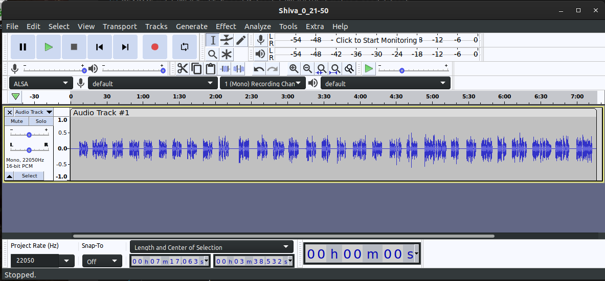

# TextToSpeechDataset
This repository details how I created a text to speech dataset using Audacity (an opensource audio platform)

## First things first

* Download the [audacity](https://www.audacityteam.org/) software.
* Familiarize with the [software](https://manual.audacityteam.org/index.html#using).

## Recording the voice samples
Before you can record the voice, you need a good script. The script should contain sentences that are short, long but no duplicates.
* It is useful to create a script for a voice model. Print out this script or keep it handy.
* I followed this script from microsoft: [English-USA](https://github.com/Azure-Samples/Cognitive-Speech-TTS/blob/master/CustomVoice/script/English%20(United%20States)_en-US/0000000001_0300000050_General.txt)
* Recording equipment: I used Logitech Blue Yeti microphone.[](https://www.amazon.com/gp/product/B00N1YPXW2/ref=ppx_yo_dt_b_search_asin_title?ie=UTF8&psc=1)
* Recording requirements:
  * Clear and well pronounced
  * Natural speed
  * Appropriate volume
  * less noise during recording: Audacity can help clean up a lot of noise.
  * There should be atleast 1 second silence between each sentence. 

* Put in time to record the voice.

## Audacity: formatting your dataset
* By now, you have recorded your voice using the transcripts. Now the speech must be divided into audio clips matching the transcript.
* .wav format is recommended to prevent compressions artifacts.
* upload the audio to Audacity:
  * Start by cleaning the background noise in the audio.
  * Here is a [tutorial](https://www.youtube.com/watch?v=ARfRW89rHzY) for removing background noise.
  * Edit the audio clips for too many silences within the sentence.
  * Follow this [tutorial](https://www.youtube.com/watch?v=RD7VJGZs9o8) and [this](https://helpdeskgeek.com/how-to/how-to-split-audio-in-audacity-and-other-useful-tricks/) to split the single file to multiple files.
  * It is time now to create the dataset, having the following folder structure.
  ```
    /MyTTSDataset
      |
      | -> metadata.txt
      | -> /wavs
              | -> audio1.wav
              | -> audio2.wav
              | ...
  ```
* I have uploaded a sample folder structure in this repository.
* Here is a sample metadata.txt file
  ```
  # metadata.txt
  audio1|This is my sentence.
  audio2|This is maybe my sentence.
  audio3|This is certainly my sentence.
  audio4|Let this be your sentence.
  ...
  ```
## What makes a good dataset
* Follow this [link](https://tts.readthedocs.io/en/latest/what_makes_a_good_dataset.html)
* dataset formatting:
  * Sample Rate: If your dataset has a very high bit-rate, that might cause slow data-load time and consequently slow training. It is better to reduce the sample-rate of your dataset to around 16000-22050.
  * Sample format: 16 bit, PCM
  * SNR > 35 dB
  * Peak volume levels	-3 dB to -6 dB
  * Environment noise: The level of noise at start of the wave before speaking < -70 dB
  * Follow this [link](https://learn.microsoft.com/en-us/azure/cognitive-services/speech-service/record-custom-voice-samples) to avoid the typical audio errors.




